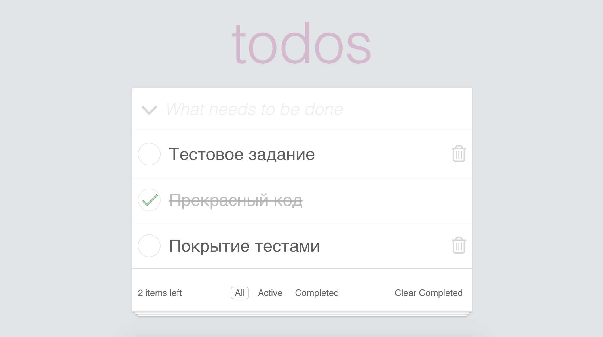
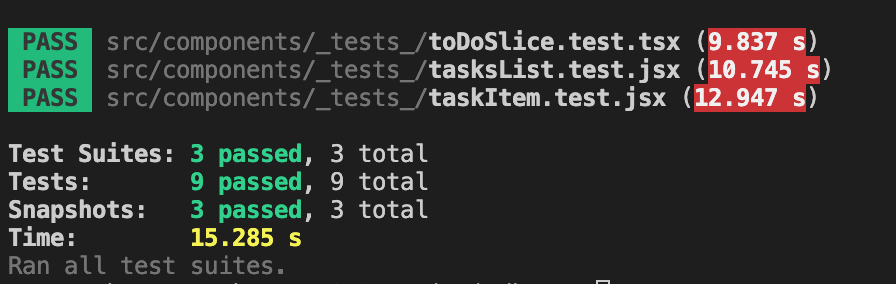

# Проект: To do list

### Обзор

**Интро**

Сделать ToDo-приложение, позволяющее управлять текущим списком дел
Что должно быть в интерфейсе:
- Поле для ввода новой задачи
- Списки всех задач, невыполненных и выполненных задач (по отдельности)

#### Технологии:
- React
- Redux toolkit
- Typescript

### Требования к коду:
- Приложение создано с использованием TypeScript, React и React Hooks
- Ключевая функциональность обязательно покрыта тестами
- Проект запускается командой npm i && npm run start
- Проект доступен на GitHub Pages

### Интерфейс реализованного приложения

### Реализованы тесты, покрывающие основную функциональность

**GitHubPages**

* [Ссылка на страницу](https://xatepk.github.io/mindbox/)

**Планы**

*Следовать указаниям код-ревьюера*
